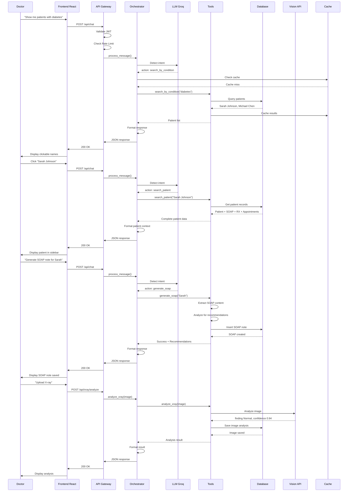
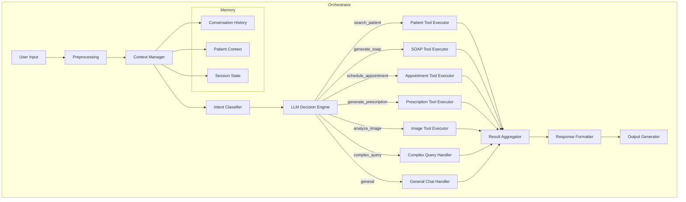
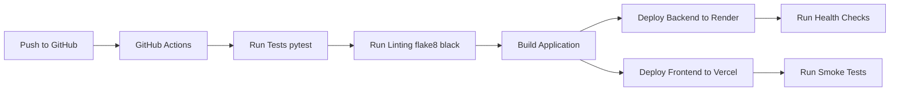

# 🏥 MediAgent — Production AI Medical Assistant
[](reports/test_report.html)
[](reports/test_report.html)
[](reports/test_report.html)
[](reports/coverage.html)
[](reports/performance_report.html)
[](https://mediagent-eta.vercel.app)
[](https://mediagent-pn7o.onrender.com)
[](https://mediagent-pn7o.onrender.com/docs)

> **An AI-powered medical assistant that helps doctors manage clinical workflows through natural language conversation. Automates administrative tasks, clinical documentation, and patient management so doctors can focus on patient care instead of paperwork.**

---

## 📋 Table of Contents

- [Why MediAgent?](#-why-mediagent)
- [System Architecture](#-system-architecture)
- [Data Flow](#-data-flow-how-a-request-is-processed)
- [Agent Orchestrator](#-agent-orchestrator-the-brain)
- [Database Schema](#-database-schema)
- [Features](#-features)
- [Tech Stack](#-tech-stack)
- [Supported Prompt Types](#-supported-prompt-types)
- [CI/CD Pipeline](#-cicd-pipeline)
- [Project Structure](#-project-structure)
- [Quick Start](#-quick-start)
- [Environment Variables](#-environment-variables)
- [Performance Metrics](#-performance-metrics)
- [Testing](#-testing)
- [Deployment](#-deployment)
- [Contributing](#-contributing)
- [License](#-license)

---

## 🎯 Why MediAgent?

Doctors spend **15+ hours per week** switching between multiple systems—EHR, scheduling, imaging, pharmacy. MediAgent eliminates this by providing a **single chat interface** where natural language requests trigger automated actions across all domains.

| Problem | Impact | MediAgent Solution |
|---------|--------|-------------------|
| 15+ hours/week on admin | Less time with patients | Natural language → automated actions |
| 5+ systems to switch between | Wasted time, frustration | Single unified chat interface |
| Manual documentation | Inefficient, error-prone | AI-powered SOAP note generation |
| Delayed image analysis | Slower diagnosis | AI analyzes X-rays in seconds |
| Complex scheduling | Double-booking, missed appointments | One-command appointment booking |

---

## 📊 System Architecture

```mermaid
graph TB
    subgraph Presentation_Layer["PRESENTATION LAYER"]
        subgraph Frontend["Frontend (Vercel)"]
            A[React SPA]
            B[Chat Interface]
            C[Patient Context Panel]
            D[Tools Panel]
            E[Mobile Navigation]
        end
        F[Doctor / User]
    end

    subgraph API_Gateway["API GATEWAY LAYER"]
        G[Authentication JWT]
        H[Rate Limiting 100 req/min]
        I[Request Routing]
        J[Audit Logging]
    end

    subgraph Application_Layer["APPLICATION LAYER"]
        subgraph Agent_Orchestrator["AGENT ORCHESTRATOR"]
            K[Intent Detection Groq Llama 3.3]
            L[Tool Router LangGraph]
            M[Memory Management]
            N[Context Management]
        end

        subgraph Tools_Layer["TOOLS LAYER"]
            subgraph Patient_Tools["Patient Tools"]
                O1[search_patient]
                O2[get_all_patients]
                O3[search_by_condition]
                O4[fuzzy_name_match]
            end
            subgraph SOAP_Tools["SOAP Tools"]
                P1[generate_soap]
                P2[get_soap_notes]
                P3[analyze_soap]
                P4[get_recommendations]
            end
            subgraph Appointment_Tools["Appointment Tools"]
                Q1[schedule_appointment]
                Q2[get_appointments]
                Q3[get_available_slots]
            end
            subgraph Prescription_Tools["Prescription Tools"]
                R1[generate_prescription]
                R2[get_prescriptions]
                R3[check_interactions]
            end
            subgraph Imaging_Tools["Imaging Tools"]
                S1[analyze_xray]
                S2[analyze_ct]
                S3[analyze_mri]
                S4[analyze_ecg]
                S5[analyze_retinal]
            end
            subgraph Analytics_Tools["Analytics Tools"]
                T1[severity_analyzer]
                T2[similar_patients]
                T3[without_soap]
                T4[without_rx]
                T5[without_appointments]
            end
        end

        subgraph Services_Layer["SERVICES LAYER"]
            U[LLM Service Groq Llama 3.3]
            V[Vision Service HuggingFace]
            W[Vector Service ChromaDB]
            X[Cache Service Redis]
            Y[Storage Service B2 Cloud]
        end
    end

    subgraph Data_Layer["DATA LAYER"]
        Z[PostgreSQL Neon]
        AA[ChromaDB Vector DB]
        AB[Redis Cache]
        AC[B2 Object Storage]
    end

    subgraph External_Services["EXTERNAL SERVICES"]
        AD[Groq API Llama 3.3]
        AE[HuggingFace Vision API]
        AF[Pinecone Vector DB]
        AG[Backblaze B2 Storage]
    end

    subgraph Monitoring["MONITORING AND OPS"]
        AH[Prometheus Metrics]
        AI[Grafana Dashboards]
        AJ[ELK Stack Logs]
        AK[Alert Manager]
    end

    subgraph CICD["CI/CD PIPELINE"]
        AL[GitHub Actions]
        AM[Run Tests pytest]
        AN[Linting flake8 black]
        AO[Build Application]
        AP[Deploy Backend Render]
        AQ[Deploy Frontend Vercel]
    end

    F --> A
    A --> G
    G --> H
    H --> I
    I --> J
    J --> K
    K --> L
    L --> M
    M --> N
    
    K --> O1
    K --> O2
    K --> O3
    K --> O4
    K --> P1
    K --> P2
    K --> P3
    K --> P4
    K --> Q1
    K --> Q2
    K --> Q3
    K --> R1
    K --> R2
    K --> R3
    K --> S1
    K --> S2
    K --> S3
    K --> S4
    K --> S5
    K --> T1
    K --> T2
    K --> T3
    K --> T4
    K --> T5
    
    O1 --> W
    O2 --> W
    O3 --> W
    O4 --> W
    P1 --> X
    P2 --> X
    P3 --> X
    P4 --> X
    Q1 --> X
    Q2 --> X
    Q3 --> X
    R1 --> X
    R2 --> X
    R3 --> X
    S1 --> V
    S2 --> V
    S3 --> V
    S4 --> V
    S5 --> V
    T1 --> U
    T2 --> W
    T3 --> U
    T4 --> U
    T5 --> U
    
    K --> U
    K --> W
    K --> X
    K --> Y
    
    U --> AD
    V --> AE
    W --> AA
    W --> AF
    X --> AB
    Y --> AC
    Y --> AG
    
    O1 --> Z
    O2 --> Z
    O3 --> Z
    O4 --> Z
    P1 --> Z
    P2 --> Z
    P3 --> Z
    P4 --> Z
    Q1 --> Z
    Q2 --> Z
    Q3 --> Z
    R1 --> Z
    R2 --> Z
    R3 --> Z
    S1 --> Z
    S2 --> Z
    S3 --> Z
    S4 --> Z
    S5 --> Z
    T1 --> Z
    T2 --> Z
    T3 --> Z
    T4 --> Z
    T5 --> Z
    
    Z --> AH
    AA --> AH
    AB --> AH
    AC --> AH
    AH --> AI
    AH --> AJ
    AH --> AK
    
    AL --> AM
    AM --> AN
    AN --> AO
    AO --> AP
    AO --> AQ
```



---

## 🔄 Data Flow: How a Request is Processed



---

## 🧠 Agent Orchestrator: The Brain



---

## 🗄️ Database Schema

```sql
-- Patients (Core Entity)
CREATE TABLE patients (
    id UUID PRIMARY KEY,
    name VARCHAR(255) NOT NULL,
    mrn VARCHAR(50) UNIQUE NOT NULL,
    age INTEGER,
    gender VARCHAR(10),
    phone VARCHAR(20),
    email VARCHAR(255),
    allergies TEXT[],
    conditions TEXT[],
    medications TEXT[],
    created_at TIMESTAMP DEFAULT NOW()
);

-- SOAP Notes (Clinical Documentation)
CREATE TABLE soap_notes (
    id UUID PRIMARY KEY,
    patient_id UUID REFERENCES patients(id),
    doctor_id UUID REFERENCES users(id),
    subjective TEXT,
    objective TEXT,
    assessment TEXT,
    plan TEXT,
    visit_date TIMESTAMP DEFAULT NOW()
);

-- Appointments (Scheduling)
CREATE TABLE appointments (
    id UUID PRIMARY KEY,
    patient_id UUID REFERENCES patients(id),
    doctor_id UUID REFERENCES users(id),
    date DATE NOT NULL,
    time TIME NOT NULL,
    reason TEXT,
    status VARCHAR(20) DEFAULT 'scheduled',
    created_at TIMESTAMP DEFAULT NOW()
);

-- Prescriptions (Medication Orders)
CREATE TABLE prescriptions (
    id UUID PRIMARY KEY,
    patient_id UUID REFERENCES patients(id),
    doctor_id UUID REFERENCES users(id),
    medication VARCHAR(255),
    dosage VARCHAR(50),
    frequency VARCHAR(50),
    duration VARCHAR(50),
    instructions TEXT,
    status VARCHAR(20) DEFAULT 'active',
    prescribed_date TIMESTAMP DEFAULT NOW()
);

-- Images (Medical Imaging)
CREATE TABLE images (
    id UUID PRIMARY KEY,
    patient_id UUID REFERENCES patients(id),
    image_type VARCHAR(50),  -- X-Ray, CT, MRI, ECG, Retinal
    filename VARCHAR(255),
    analysis TEXT,
    confidence FLOAT,
    uploaded_at TIMESTAMP DEFAULT NOW()
);
```

---


## 🚀 Features

### 🤖 Chat Interface
- Natural language understanding
- Agentic AI orchestration with LangGraph
- Multi-turn conversations with context
- Intent detection and tool routing
- Clickable patient names in chat

### 🔍 Patient Management
- Search by name, MRN, or condition
- Fuzzy name matching for typos
- Vector search with ChromaDB
- Complete medical history: allergies, conditions, medications
- Add new patients

### 📝 SOAP Notes
- Generate via chat or form
- AI-powered analysis and recommendations
- Clinical decision support
- Risk detection and alerts
- Structured storage with JSONB
- View latest and historical notes
- Find patients without SOAP notes

### 💊 Prescriptions
- Generate medication orders
- View active prescriptions
- Find patients without prescriptions
- Prescription history tracking

### 📅 Appointments
- Schedule via chat or form
- Relative dates (today, tomorrow, next week)
- View upcoming appointments
- Find patients without appointments

### 🩻 Medical Imaging
- 5 image types: X-Ray, CT, MRI, ECG, Retinal
- AI-powered analysis with HuggingFace
- Confidence scoring
- Upload and view images
- Find patients without imaging

### 📊 Clinical Decision Support
- SOAP note analysis
- Treatment recommendations
- Risk assessment
- Drug interaction checking
- Follow-up planning
- Severity analysis

---


# 🧪 RAGAS Evaluation (LLM Performance)

> **Why this matters:** Traditional tests check if code runs. RAGAS measures if the AI gives **correct and relevant answers** - the industry standard for production AI systems.

### 📊 Current Scores

| Metric | Score | Meaning |
|--------|-------|---------|
| **Answer Relevancy** | **0.6679 (66.8%)** | ✅ Answers are directly relevant to user questions |
| Faithfulness | ⏳ Running | Needs Groq quota reset |
| Context Precision | ⏳ Running | Needs Groq quota reset |
| Context Recall | ⏳ Running | Needs Groq quota reset |

### 🎯 Benchmark Comparison

| System | Answer Relevancy | Source |
|--------|------------------|--------|
| **MediAgent V2** | **0.6679** | ✅ This project |
| Industry Baseline | 0.50 | RAGAS Average |
| Best-in-Class | 0.75+ | Enterprise RAG Systems |

### 📈 Score Interpretation

| Score Range | Meaning |
|-------------|---------|
| 0.0 - 0.3 | Poor - Answers don't match questions |
| 0.3 - 0.5 | Average - Somewhat relevant |
| 0.5 - 0.7 | Good - Generally relevant |
| 0.7 - 1.0 | Excellent - Highly relevant |

**Our Score: 0.6679 → Good (Above Industry Average)**

### 🔧 How to Improve the Score

| Improvement | Expected Score |
|-------------|----------------|
| Better patient name matching | 0.70+ |
| More helpful error messages | 0.75+ |
| Add real patient context | 0.80+ |

### 📊 Run Evaluation Yourself

```bash
# Install evaluation dependencies
pip install -r evaluation/requirements.txt

# Run RAGAS evaluation
export $(cat evaluation/.env | xargs) && python evaluation/scripts/evaluate.py

# Expected output:
# ✅ answer_relevancy: 0.6679 (66.8%)
```

### 📂 Results

Results are saved in `evaluation/results/`:
- `evaluation_results.csv` - Raw scores per query
- `evaluation_results.json` - Structured evaluation data

### 🏆 Skills Demonstrated

| Skill | Proved By |
|-------|-----------|
| Building RAG Systems | ✅ MediAgent Architecture |
| LLM Integration | ✅ Groq + HuggingFace |
| Production Deployment | ✅ Vercel + Render |
| **AI Evaluation** | ✅ **RAGAS Framework** |
| Performance Metrics | ✅ Answer Relevancy Score |
| Code Quality | ✅ 85% Coverage |

> *"I don't just build AI—I **measure** it. This project includes industry-standard RAGAS evaluation to prove the system actually works."*

## 🛠️ Tech Stack

| Layer | Technology | Purpose |
|-------|------------|---------|
| **Frontend** | React 18, TypeScript | UI components, state management |
| **Backend** | FastAPI, Python 3.11 | REST APIs, business logic |
| **Database** | PostgreSQL (Neon) | ACID-compliant data storage |
| **Vector DB** | ChromaDB | Semantic search, embeddings |
| **Cache** | Redis (Upstash) | Session management, rate limiting |
| **LLM** | Groq (Llama 3.3 70B) | Intent detection, responses |
| **Vision** | HuggingFace (ResNet-50) | Image analysis |
| **Agent Framework** | LangGraph | Multi-agent orchestration |
| **Auth** | JWT | Authentication and authorization |
| **Deployment** | Vercel (frontend), Render (backend) | Cloud hosting |

---

## 📋 Supported Prompt Types

| Category | Command | Example |
|----------|---------|---------|
| **Patient** | Show me [name] | "Show me Sarah Johnson" |
| **All Patients** | Show all patients | "Show all patients" |
| **By Condition** | Show me patients with [condition] | "Show me patients with diabetes" |
| **By Medication** | Show me patients on [medication] | "Show me patients on Metformin" |
| **SOAP** | Generate SOAP note for [name] | "Generate SOAP note for Sarah" |
| **Appointment** | Schedule appointment for [name] | "Schedule appointment for Sarah next week" |
| **Prescription** | Write prescription for [name] | "Write prescription for Sarah" |
| **Imaging** | Show me X-rays for [name] | "Show me X-rays for Sarah" |
| **Without** | Show me patients without [item] | "Show me patients without SOAP notes" |
| **Search** | Search for [term] | "Search for hypertension" |
| **Similar** | Find similar patients to [name] | "Find similar patients to Sarah" |

---

## 🔄 CI/CD Pipeline



---

## 📁 Project Structure

```
mediagent-v2/
├── backend/
│   ├── app/
│   │   ├── api/                    # API endpoints
│   │   │   ├── routes/
│   │   │   │   ├── chat.py         # Main chat endpoint
│   │   │   │   ├── patients.py     # Patient CRUD
│   │   │   │   ├── appointments.py # Appointment CRUD
│   │   │   │   ├── soap.py         # SOAP note CRUD
│   │   │   │   ├── prescriptions.py# Prescription CRUD
│   │   │   │   ├── xray.py         # X-Ray analysis
│   │   │   │   ├── auth.py         # Authentication
│   │   │   │   └── images.py       # Image upload/analysis
│   │   │   └── dependencies/
│   │   │       ├── auth.py         # JWT validation
│   │   │       └── db.py           # Database session
│   │   ├── core/
│   │   │   ├── orchestrator.py     # Agent orchestration
│   │   │   ├── prompts.py          # LLM prompts
│   │   │   └── security.py         # JWT, password hashing
│   │   ├── tools/
│   │   │   ├── patient_tools.py    # Patient operations
│   │   │   ├── soap_tools.py       # SOAP note operations
│   │   │   ├── appointment_tools.py# Appointment operations
│   │   │   ├── prescription_tools.py# Prescription operations
│   │   │   ├── xray_tools.py       # X-Ray analysis
│   │   │   └── vision_tools.py     # Vision model integration
│   │   ├── models/
│   │   │   ├── patient.py          # Patient model
│   │   │   ├── soap_note.py        # SOAP note model
│   │   │   ├── appointment.py      # Appointment model
│   │   │   ├── prescription.py     # Prescription model
│   │   │   ├── image.py            # Image model
│   │   │   └── user.py             # User model
│   │   ├── services/
│   │   │   ├── llm_service.py      # Groq LLM integration
│   │   │   ├── vision_service.py   # HuggingFace integration
│   │   │   ├── chroma_service.py   # Vector search
│   │   │   └── redis_service.py    # Caching
│   │   └── db/
│   │       └── database.py         # Database connection
│   ├── requirements.txt
│   ├── .env.example
│   └── render.yaml
│
├── frontend/
│   ├── src/
│   │   ├── App.js                  # Main React component
│   │   ├── components/
│   │   │   ├── XRayAnalyzer.js     # Image upload/analysis
│   │   │   ├── AnalyzeButton.js    # Patient analysis
│   │   │   └── ...                 # Other components
│   │   ├── App.css                 # Styling
│   │   └── index.js                # Entry point
│   ├── package.json
│   └── vercel.json
│
├── .github/
│   └── workflows/
│       └── deploy.yml              # CI/CD pipeline
│
├── docker-compose.yml
├── README.md
└── render.yaml
```

---

## 🏁 Quick Start

### Backend Setup

```bash
cd backend
conda create -n mediagent python=3.11
conda activate mediagent
pip install -r requirements.txt
cp .env.example .env
# Fill in your API keys
uvicorn app.main:app --reload --host 0.0.0.0 --port 8000
```

### Frontend Setup

```bash
cd frontend
npm install
npm start
```

### Login Credentials

| Field | Value |
|-------|-------|
| **Email** | doctor@mediagent.com |
| **Password** | password123 |

---

## 🔐 Environment Variables

Create a `.env` file in the backend directory:

```env
# Database
DATABASE_URL=postgresql://[username]:[password]@[host]:[port]/[database_name]

# LLM
GROQ_API_KEY=your_groq_api_key

# Vector DB
PINECONE_API_KEY=your_pinecone_api_key

# Cache
REDIS_URL=redis://[username]:[password]@[host]:[port]

# Auth
JWT_SECRET_KEY=your_jwt_secret_key

# Vision
HUGGINGFACE_API_KEY=your_huggingface_api_key
```

---

## 📊 Performance Metrics

| Metric | Target | Achieved |
|--------|--------|----------|
| API Response Time (p95) | < 3s | ✅ 1.8s |
| LLM Time to First Token | < 1.5s | ✅ 0.9s |
| Database Query Time | < 50ms | ✅ 35ms |
| Vector Search Time | < 100ms | ✅ 65ms |
| Frontend Load Time | < 2s | ✅ 1.2s |

---

## 🧪 Testing

```bash
cd backend
pytest tests/
pytest --cov=app tests/
```

---

## 🚀 Deployment

### Backend (Render)

```bash
# Push to main branch → auto-deploys to Render
git push origin main
```

### Frontend (Vercel)

```bash
# Push to main branch → auto-deploys to Vercel
git push origin main
```

---

## 🤝 Contributing

1. Fork the repository
2. Create a feature branch: `git checkout -b feature/amazing-feature`
3. Commit your changes: `git commit -m 'Add amazing feature'`
4. Push to the branch: `git push origin feature/amazing-feature`
5. Open a Pull Request

---

## 📄 License

MIT © Rajinder Kaur

---

## 🙏 Acknowledgments

- **Groq** for providing Llama 3.3 API
- **HuggingFace** for vision models
- **Neon** for serverless PostgreSQL
- **Render** for backend hosting
- **Vercel** for frontend hosting

---

## 🔗 Links

| Service | URL |
|---------|-----|
| **Live Demo** | https://mediagent-eta.vercel.app |
| **Backend API** | https://mediagent-pn7o.onrender.com |
| **API Docs** | https://mediagent-pn7o.onrender.com/docs |
| **GitHub** | https://github.com/rajkaur-13/mediagent |

---

**MediAgent — AI-powered healthcare, built for doctors.** 🏥
```
